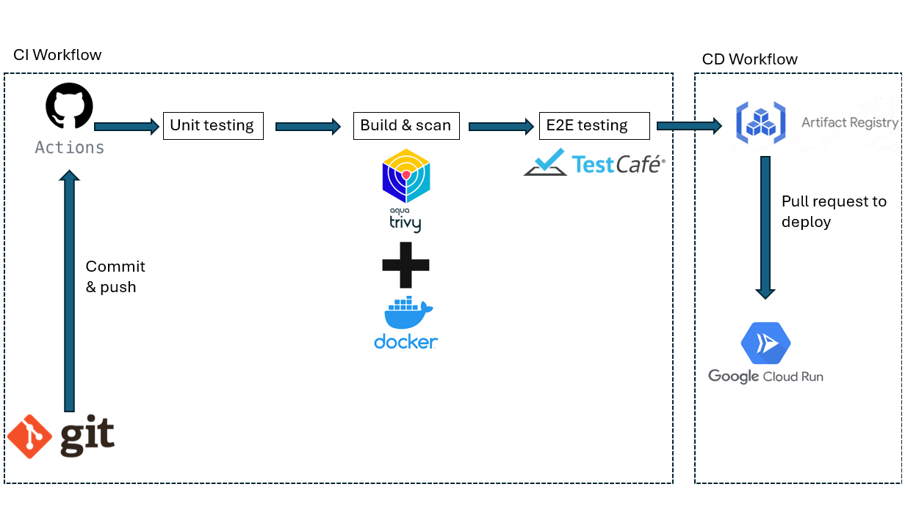

# Mail Microservice

This is a microservice built using Flask for sending emails via Gmail API. It provides a RESTful API endpoint `/send_email` to send emails programmatically. The microservice is containerized using Docker and can be deployed to Google Cloud Run.

## CI/CD Pipeline Diagram



## Prerequisites

Before running the microservice, ensure you have the following installed:

- Python 3.x
- Docker
- Google Cloud SDK (gcloud)

## Setup

1. Clone this repository:

   ```bash
   git clone <repository-url>
2. Navigate to the project directory:
   ```bash
   cd mail_microservice
3. Install dependencies:

   ```bash
   pip install -r requirements.txt
4. Obtain Google OAuth2 credentials and save them as credentials.json in the project directory. Ensure the credentials have access to the Gmail API.

   ```bash
   python mail_service.py
## Dockerization

This microservice is Dockerized to simplify deployment. The Dockerfile defines the environment and dependencies required to run the service. To build the Docker image:

   ```bash
   docker build -t onzecord-mail .
   ```

## Deployment to Google Cloud Run
To deploy the microservice to Google Cloud Run, follow these steps:

- Ensure you have the Google Cloud SDK installed and authenticated.
- Modify the cloudbuild.yaml file with your project details.
- Run the Cloud Build command to build and deploy the container:
  ```bash
  gcloud builds submit --config cloudbuild.yaml
  ```
## API USAGE

### Sending an Email
Send a POST request to the /send_email endpoint with the following parameters:

- to: Email address of the recipient
- subject: Subject of the email
- message: Body of the email

Example using Python:
  ```python
  import requests
  url = 'https://onzecord-mail-ynl52tk6za-ey.a.run.app/send_email'
  data = {
    'to': 'recipient@example.com',
    'subject': 'Test Email',
    'message': 'This is a test email.'
  }
  response = requests.post(url, json=data)
  print(response.json())
  ```
Example using Node.js:
  ```javascript
  const axios = require('axios');

  const data = {
    to: 'recipient@example.com',
    subject: 'Test Email',
    message: 'This is a test email.'
  };

  axios.post('https://onzecord-mail-ynl52tk6za-ey.a.run.app/send_email', data)
    .then(response => console.log(response.data))
    .catch(error => console.error(error));
  ```

Example using PHP:
  ```php
  $data = [
    'to' => 'recipient@example.com',
    'subject' => 'Test Email',
    'message' => 'This is a test email.'
];

$ch = curl_init('https://onzecord-mail-ynl52tk6za-ey.a.run.app/send_email');
curl_setopt($ch, CURLOPT_RETURNTRANSFER, true);
curl_setopt($ch, CURLOPT_POST, true);
curl_setopt($ch, CURLOPT_POSTFIELDS, json_encode($data));
curl_setopt($ch, CURLOPT_HTTPHEADER, ['Content-Type: application/json']);

$response = curl_exec($ch);
curl_close($ch);

echo $response;
  ```
## Acknowledgements

Special thanks to Pascal Rohart for utilizing this microservice in his project, Reminder-Manager.
Check out his project:  
[https://github.com/Insset-G2/reminder-manager](https://github.com/Insset-G2/reminder-manager)